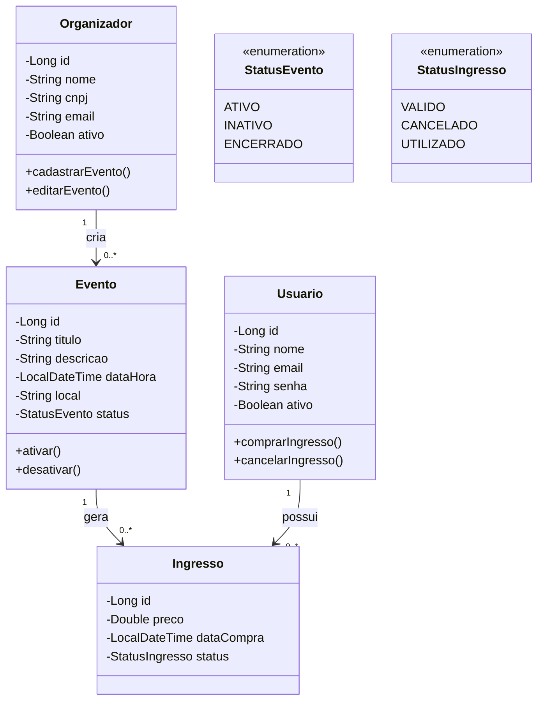

```mermaid
classDiagram
    class Usuario {
        -Long id
        -String nome
        -String email
        -String senha
        -Boolean ativo
        +comprarIngresso()
        +cancelarIngresso()
    }

    class Organizador {
        -Long id
        -String nome
        -String cnpj
        -String email
        -Boolean ativo
        +cadastrarEvento()
        +editarEvento()
    }

    class Evento {
        -Long id
        -String titulo
        -String descricao
        -LocalDateTime dataHora
        -String local
        -StatusEvento status
        +ativar()
        +desativar()
    }

    class Ingresso {
        -Long id
        -Double preco
        -LocalDateTime dataCompra
        -StatusIngresso status
    }

    class StatusEvento {
        <<enumeration>>
        ATIVO
        INATIVO
        ENCERRADO
    }

    class StatusIngresso {
        <<enumeration>>
        VALIDO
        CANCELADO
        UTILIZADO
    }

    Organizador "1" --> "0..*" Evento : cria
    Evento "1" --> "0..*" Ingresso : gera
    Usuario "1" --> "0..*" Ingresso : possui
```