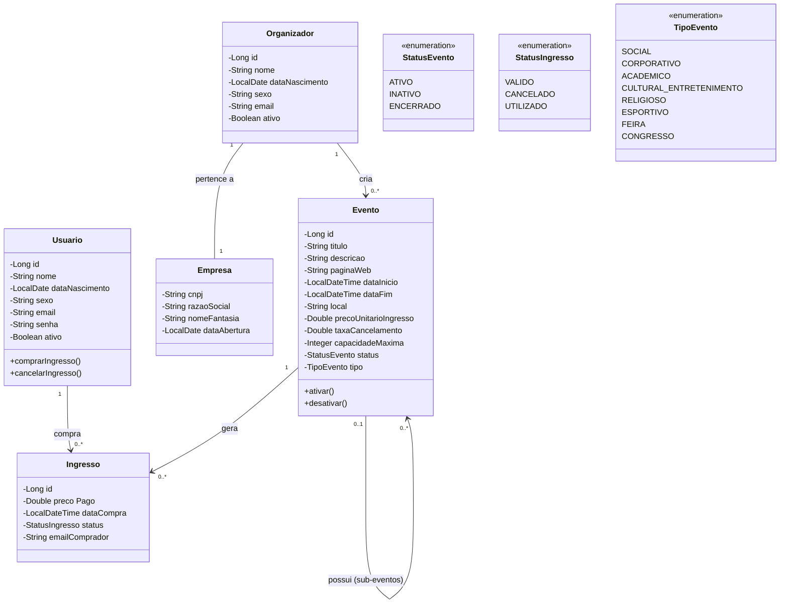

```mermaid
classDiagram
    class Usuario {
        -Long id
        -String nome
        -LocalDate dataNascimento
        -String sexo
        -String email
        -String senha
        -Boolean ativo
        +comprarIngresso()
        +cancelarIngresso()
    }

    class Organizador {
        -Long id
        -String nome
        -LocalDate dataNascimento
        -String sexo
        -String email
        -Boolean ativo
    }

    class Empresa {
        -String cnpj
        -String razaoSocial
        -String nomeFantasia
        -LocalDate dataAbertura
    }

    class Evento {
        -Long id
        -String titulo
        -String descricao
        -String paginaWeb
        -LocalDateTime dataInicio
        -LocalDateTime dataFim
        -String local
        -Double precoUnitarioIngresso
        -Double taxaCancelamento
        -Integer capacidadeMaxima
        -StatusEvento status
        -TipoEvento tipo
        +ativar()
        +desativar()
    }

    class Ingresso {
        -Long id
        -Double preco Pago
        -LocalDateTime dataCompra
        -StatusIngresso status
        -String emailComprador
    }

    class StatusEvento {
        <<enumeration>>
        ATIVO
        INATIVO
        ENCERRADO
    }

    class StatusIngresso {
        <<enumeration>>
        VALIDO
        CANCELADO
        UTILIZADO
    }

    class TipoEvento {
        <<enumeration>>
        SOCIAL
        CORPORATIVO
        ACADEMICO
        CULTURAL_ENTRETENIMENTO
        RELIGIOSO
        ESPORTIVO
        FEIRA
        CONGRESSO
    }

    Organizador "1" -- "1" Empresa : pertence a
    Organizador "1" --> "0..*" Evento : cria
    Evento "1" --> "0..*" Ingresso : gera
    Evento "0..1" --> "0..*" Evento : possui (sub-eventos)
    Usuario "1" --> "0..*" Ingresso : compra
```